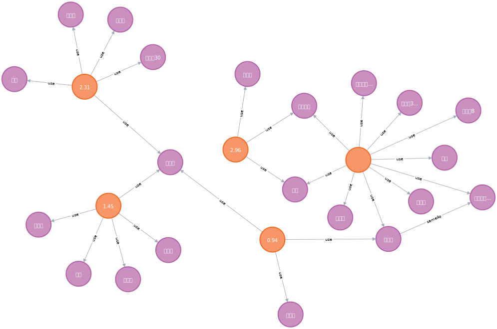

# 知识图谱

知识图谱技术是一种用于组织、表示和管理知识的方法，它旨在将丰富多样的信息转化为结构化的、可计算的形式，以便计算机系统能够理解和处理。本项目为东南大学 2023-2024 学年中人工智能专业课程《知识工程》以及《知识工程专题实践》的课程笔记和课程项目。

## 项目导览

- [知识建模（Knowledge Modeling）](theory/ch1.knowledge%20modeling/note.md)
- [知识推理（Knowledge Reasoning）](theory/ch2.knowledge%20reasoning/note.md)
- [知识构建（Knowledge Construction）](theory/ch3.knowledge%20construction/note.md)
- [知识对齐（Knowledge Alignment）](theory/ch4.knowledge%20alignment/note.md)
- [知识查询（Knowledge Query）](theory/ch5.knowledge%20query/note.md)
- [实践课程项目：糖尿病用药预测](project/docs/assignment.pdf)

## 其他资源推荐

|资源|应用领域|描述|
|:-:|:-:|:-:|
|[Protege](https://protege.stanford.edu/)|知识建模|一个开源的本体建模工具，用于创建和编辑本体模型，支持本体的可视化建模、编辑和推理|
|[Datalog](https://datalog.dev/)|知识推理|一种声明式的逻辑编程语言，用于表示和查询基于逻辑的知识|
|[RDFox](https://www.oxfordsemantic.tech/rdfox)|知识推理|一个高性能的知识图谱推理引擎，支持基于逻辑的推理|
|[Jena](https://jena.apache.org/index.html)|知识查询|一个开源的语义网框架，用于构建语义网和 Linked Data 应用程序|
|[Neo4j](https://neo4j.com/)|知识查询|开源的图数据库，可以用于知识图谱存储、执行 Cypher 查询等|
|[OpenKG](http://openkg.cn/)||中文开放知识图谱社区联盟项目|

