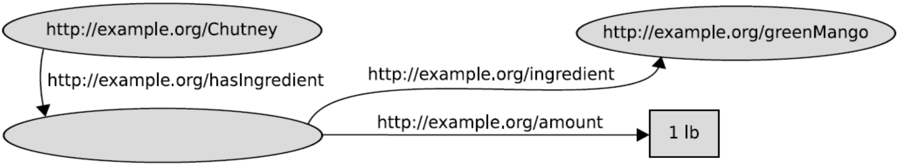

# 知识建模

使用计算机可以处理的数据格式来表示以人类自然语言的形式存在的知识，进而用于知识图谱的表示，在 W3C 的架构中体现为 XML、RDF、RDFS 和 OWL。

<center>

</center>

## XML（eXtensible Markup Language）

XML 是一种用于存储和传输数据的标记语言，同意了不同设备的数据交换格式。基本的 XML 示例如下：
```xml
<?xml version="1.0" encoding="UTF-8"?>  （XML 文档声明）
<!-- comment is written here -->        （注释）
<AuthorList>                            （有且只有一个的根元素）
    <author email="gqi@seu.edu.cn">     （开始标记 <tag> & 属性值）
        <firstName>Guilin</firstName>   （嵌套的 XML 元素）
        <lastName>Qi</lastName>
        <description>                   （使用 <![CDATA[ … ]]> 表示可能引起歧义的文本）
            <![CDATA[<h1>teacher in SEU</h1>]]>
        </description>
        some text inside XML element.   （可选的文本）
    </author>                           （结束标记 </tag>）
</AuthorList>
```

为了避免命名冲突，可以使用前缀以及 XML 命名空间（通过 URI 表示）来解决。
```xml
<h:table>
    <h:tr>
        <h:td>Apples</h:td>
        <h:td>Bananas</h:td>
    </h:tr>
</h:table>
<!-- ------------------------------- prefix -------------------------------- -->
<f:table>
    <f:name>African Coffee Table</f:name>
    <f:width>80</f:width>
    <f:length>120</f:length>
</f:table>
```

```xml
<h:table xmlns:h="http://www.w3.org/TR/html4/"> （前缀缺省时为块默认命名空间）
    <h:tr>
        <h:td>Apples</h:td>
        <h:td>Bananas</h:td>
    </h:tr>
</h:table>
<!-- --------------------------- namespace(URI) ---------------------------- -->
<f:table xmlns:f="http://www.w3cschool.cc/furniture">
    <f:name>African Coffee Table</f:name>
    <f:width>80</f:width>
    <f:length>120</f:length>
</f:table>
```

统一标识符的一些基本概念：

- URL（Uniform Resource Locator）例如 `https://en.wikipedia.org/wiki/China`
<br/>
- URN（Uniform Resource Name）例如出版物的 ISBN
<br/>
- URI（Uniform Resource Identifier）只允许英文字符，URL & URN $\subseteq$ URI
<br/>
- IRI（International Resource Identifier）使用 Unicode 编码多种语言，URI $\subseteq$ IRI

由于 XML 本身的结构、元素不固定，可以使用 XML Schema 来规范化 XML 的结构，例如：
```xml
<?xml version="1.1" encoding="utf-16"?>
<xsd:schema xmlns:xsd="http://www.w3.org/2001/XMLSchema">
    <xsd:element name="author" type="xsd:string" minOccurs="1" maxOccurs="unbounded">
        <xsd:attribute name="email" type="xsd:string" use="required"/>
        <xsd:attribute name="homepage" type="xsd:anyURI" use="optional"/>
    </xsd:element>
</xsd:schema>
```

## RDF（Resource Description Framework）

RDF 使用三元组（subject，predicate，object）对知识进行建模，由 RDF 三元组组成的数据库相当于一个有向图，用于表示知识图谱（顶点：subject & object；边：predicate）

|Subject|Predicate|Object|
|:-:|:-:|:-:|
|资源（resource，以 IRI 标识）或空节点（blank node）|资源|资源、字面值（literal）或空节点|

对于资源的 IRI 表示可以通过前缀来简写，如 `http://dbpedia.org/resource/Boston -> db:Boston`。

字面值可以是数值、字符串，如 `"France"` `"France"^^xsd:string` `"France"@en` `"10"^^xsd:integer`。

空节点可以表示一些未命名资源（unnamed resource），例如：

<center>

</center>

<br/>

使用 Turtle（Terse RDF Triple Language）格式来表示 RDF 三元组的示例如下：
```
@prefix ex: <http://example.org/> .     （声明前缀）

ex:Sam ex:gender ex:male .              （使用 . 作为单句结束标志）

ex:Jane ex:name "Jane Doe"@en ;         （相同主语不同谓语使用 ;）
        ex:age  "35"^^xsd:integer .

ex:Bob ex:hasChild ex:Jack ,            （相同主语和谓语使用 ,）
                   ex:Janifer .
```

对于较复杂的多元关系，可以考虑使用空节点表示一个复杂节点（complex node）将其转换为三元组。

<center>

</center>

<br/>

```
@prefix ex: <http://example.org/> .

ex:Chutney ex:hasIngredient _:x .       （空节点使用 _:xyz 形式表示）

_:x ex:ingredient ex:greenMango ;
    ex:amount     "1lb" .
```

## RDFS（RDF Schema）

RDFS 是建立在 RDF 上的基本词汇扩展，可以更丰富地描述、组织和推理 RDF 三元组数据。RDF 和 RDFS 组成的一些常用的基本词汇及其用法如下：

|基本词汇|描述|作用与性质|
|:-:|:-:|:-:|
|`rdf:type`|标识实体的类别|连接 Instance 层和 Schema 层的桥梁|
|`rdfs:Class`|类别的类别||
|`rdfs:Property`|属性的类别||
|`rdfs:subClassOf`|子类关系|自反性、传递性，可以用于类别关系推理，形成类别层次|
|`rdfs:subPropertyOf`|子属性关系|性质类似于 `rdfs:subClassOf`|
|`rdfs:domain`|标识属性定义域|连接属性与类别，可以用于主语的类别推理|
|`rdfs:range`|标识属性值域|连接属性与类别，可以用于宾语的类别推理|
|`rdfs:label`|标识资源的名称||

通过 RDFS 扩展的基本词汇及其附加的推理规则可以发掘出许多隐藏的三元组。

## OWL（Web Ontology Language）

本体（ontology $\approx$ schema）是一个共享概念化的一种形式化的显式规约。OWL 基于 RDF 数据格式，通过更加丰富的基本词汇和语法来描述本体。一些常见的基本词汇及其描述如下：

|基本词汇|描述|示例|
|:-:|:-:|:-:|
|`owl:equivalentClass`|类别等价|`ex:Athlete owl:equivalentClass ex:SportsPlayer`|
|`owl:equivalentProperty`|属性等价|`ex:obtain owl:equivalentProperty ex:acquire`|
|`owl:sameAs`|实体等价|`ex:SportsPlayerA owl:sameAs ex:Thomas`|
|`owl:disjointWith`|类别不相交|`ex:Man owl:disjointWith ex:Woman `|
|`owl:intersectionOf`|类别交集|`ex:Mother owl:intersectionOf` <br/> `(ex:Woman ex:Parent ...)` 可以是多个类别|
|`owl:unionOf`|类别并集|`ex:Parent owl:unionOf` <br/> `(ex:Mother ex:Father ...)` 可以是多个类别|
|`owl:complementOf`|类别补集|`ex:NonAnimal owl:complementOf ex:Animal`|
|`owl:ObjectProperty`|对象属性|`ex:friendOf rdf:type owl:ObjectProperty`|
|`owl:DataProperty`|数据属性|`ex:age rdf:type owl:DataProperty`|
|`owl:TransitiveProperty`|传递属性|`ex:ancestor rdf:type owl:TransitiveProperty`|
|`owl:FunctionalProperty`|多对一属性|`ex:hasMother rdf:type owl:FunctionalProperty`|
|`owl:InverseFunctional Property`|一对一属性|`ex:marryWith rdf:type owl:InverseFunctionalProperty`|
|`owl:SymmetricProperty`|对称属性|`ex:friendOf rdf:type owl:SymmetricProperty`|
|`owl:inverseOf`|逆属性|`ex:ancestor owl:inverseOf ex:descendant`|

OWL 加入了对描述逻辑（description logic）的支持，可以对属性施加逻辑、数量等限制条件，例如：

```
ex:Person   rdf:type           owl:Restriction ;
            owl:onProperty     ex:hasMother ;
            owl:allValuesFrom  ex:Women .

<!-- ------------------------ universal quantifier ------------------------- -->

ex:SemanticWebPapers   rdf:type            owl:Restriction ;
                       owl:onProperty      ex:publishedIn ;
                       owl:someValuesFrom  ex:AI_Conferences .

<!-- ----------------------- existential quantifier ------------------------ -->

ex:Person  rdf:type         owl:Restriction ;
           owl:onProperty   ex:hasParent ;
           owl:cardinality  "2"^^xsd:integer .
          <owl:maxCardinality / owl:minCardinality ...>

<!-- ------------------------- amount constraints -------------------------- -->
```

## 描述逻辑（Description Logic）

命题逻辑（Proposition Logic）可以通过形式化规则对原子命题组成的复合命题进行推理。一阶谓词逻辑（First Order Predicate Logic）在命题逻辑的基础上引入了个体、谓词和量词的概念，量词分为存在量词 $\exist$ 和全称量词 $\forall$。而描述逻辑在一阶谓词逻辑的基础上做了语法的简化，并且比一阶谓词逻辑降低了复杂度。
- 自然语言
$$
\mathrm{Nigiri\ is\ a\ type\ of\ Sushi\ which\ has\ ingredient\ Rice\ and\ Fish}
$$
- 一阶谓词逻辑：
$$
\forall\ x.\bigg[ \mathrm{Nigiri}(x) \rightarrow \mathrm{Sushi}(x) \wedge \exist\ y.[ \mathrm{hasIngredient}(x,\ y) \wedge \mathrm{Rice}(y) ] \wedge \exist\ z.[ \mathrm{hasIngredient}(x,\ z) \wedge \mathrm{Fish}(z) ] \bigg]
$$
- 描述逻辑：
$$
\mathrm{Nigiri} \sqsubseteq \mathrm{Sushi} \sqcap \exist \mathrm{hasIngredient}.\mathrm{Rice} \sqcap \exist \mathrm{hasIngredient}.\mathrm{Fish}
$$

用于表述描述逻辑的典型语言是 ALC（Attributive Language with Complements），包含的元字符如下：

|ALC 元字符|对应的概念|ALC 元字符|对应的概念|作用|
|:-:|:-:|:-:|:-:|:-:|
|$\top$|`owl:Thing`|$\perp$|`owl:Nothing`|概念|
|$\sqcap$|`owl:intersectionOf`|$\sqcup$|`owl:unionOf`|修饰复合概念|
|$\neg$|`owl:complementOf`|||修饰复合概念|
|$\forall$|`owl:allValuesFrom`|$\exist$|`owl:someValuesFrom`|修饰量词概念|
|$\equiv$|`owl:equivalentClass`|$\sqsubseteq$|`rdfs:subClassOf`|概念公理|

ALC 中包含两个部分，分别是 TBox $\mathscr{T}$ 和 ABox $\mathscr{A}$，代表公理（Terminology）以及断言（Assertion）。

- TBox $\mathscr{T}$ 是一系列 GCI（General Concept Inclusion）的集合，即 $\mathrm{C} \sqsubseteq \mathrm{D}$ 或 $\mathrm{C} \equiv \mathrm{D}$
<br/>
- ABox $\mathscr{A}$ 是一系列概念断言（concept assertion）和谓词断言（role assertion）的集合，即 $\mathrm{C(a)}$ 和 $\mathrm{r(a,\ b)}$

描述逻辑的解释（Interpretation）$\mathcal{I}$ 由实体映射 $\mathrm{I_{I}}$、概念断言集合 $\mathrm{I_{C}}$ 以及谓词断言集合 $\mathrm{I_{R}}$ 组成，例如：
$$
\begin{gather*}
    \mathrm{PhD_{student}} \sqsubseteq \mathrm{Student} \quad \mathrm{Student} \sqsubseteq \neg \mathrm{Employee} \\[5mm]
    \mathrm{PhD_{student}(John)} \quad \mathrm{Employee(Lisa)} \quad \mathrm{Marriedto(John,\ Lisa)}
\end{gather*}
$$

对应的一个解释是：
$$
\begin{gather*}
    \Delta = \{j,\ l\} \\[5mm]
    \mathrm{I_{I}(John)} = j \quad \mathrm{I_{I}(Lisa)} = l \\[5mm]
    \mathrm{I_{C}(PhD_{student})} = \{ j \} \quad \mathrm{I_{C}(Student)} = \{ j \} \quad \mathrm{I_{C}(Employee)} = \{ l \} \\[5mm]
    \mathrm{I_{R}(Marriedto)} = \{ (j,\ l) \}
\end{gather*}
$$

检查过程：
- 由于 $\mathrm{I_{C}(PhD_{student})} = \{ j \}$，所以 $\mathrm{I_{C}(PhD_{student})} \sqsubseteq \mathrm{I_{C}(Student)}$，即
$$
(\Delta,\ \mathcal{I}) \models \mathrm{PhD_{student}} \sqsubseteq \mathrm{Student}
$$

- 由于 $\mathrm{I_{C}(Student)} = \{ j \}$ 并且 $\mathrm{I_{C}(Employee)} = \{ l \}$，所以 $\mathrm{I_{C}(Student)} \cap \mathrm{I_{C}(Employee)} = \empty$，即
$$
(\Delta,\ \mathcal{I}) \models \mathrm{Student} \sqsubseteq \neg \mathrm{Employee}
$$

- 由于 $\mathrm{I_{I}(John)} = j$，所以 $\mathrm{I_{I}(John)} \in \mathrm{I_{C}(PhD_{student})} = \{ j \}$，即
$$
(\Delta,\ \mathcal{I}) \models \mathrm{PhD_{student}(John)}
$$

- 由于 $\mathrm{I_{I}(Lisa)} = l$，所以 $\mathrm{I_{I}(Lisa)} \in \mathrm{I_{C}(Employee)} = \{ l \}$，即
$$
(\Delta,\ \mathcal{I}) \models \mathrm{Employee(Lisa)}
$$

- 由于 $(\mathrm{I_{I}(John)},\ \mathrm{I_{I}(Lisa)}) = (j,\ l)$，所以 $(\mathrm{I_{I}(John)},\ \mathrm{I_{I}(Lisa)}) \in \mathrm{I_{R}(Marriedto)}$，即
$$
(\Delta,\ \mathcal{I}) \models \mathrm{Marriedto(John,\ Lisa)}
$$

描述逻辑中的不一致（inconsistent）代表知识库不存在对应的解释 $\mathcal{I}$，而无逻辑（incoherent）代表知识库中某个命名类别为空 $\perp$，这两种问题均由建模错误导致。