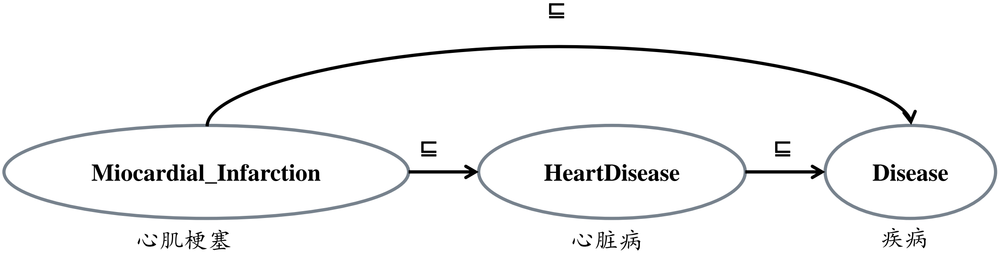
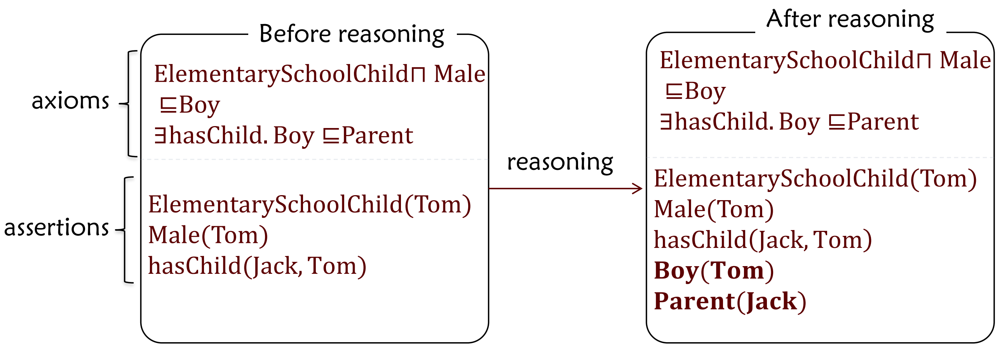
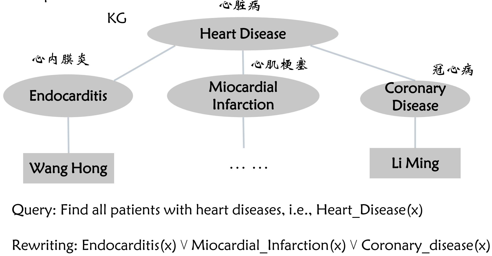
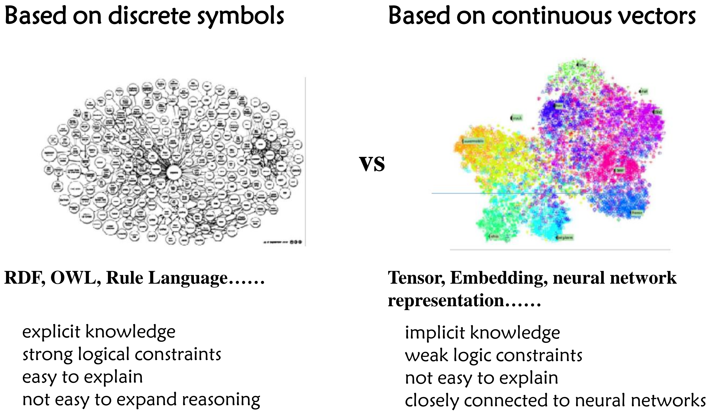
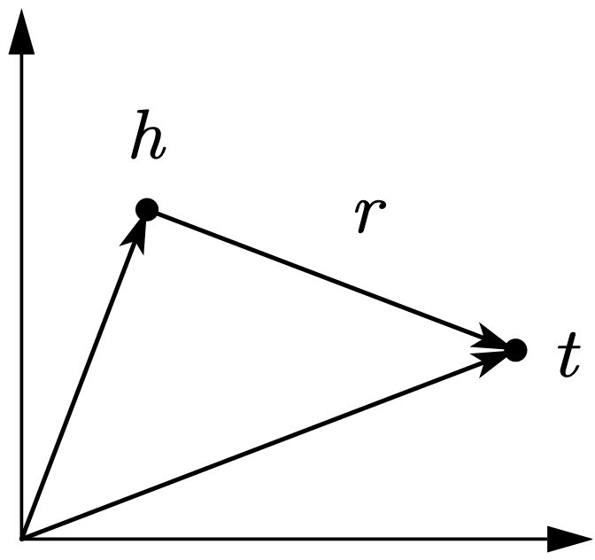
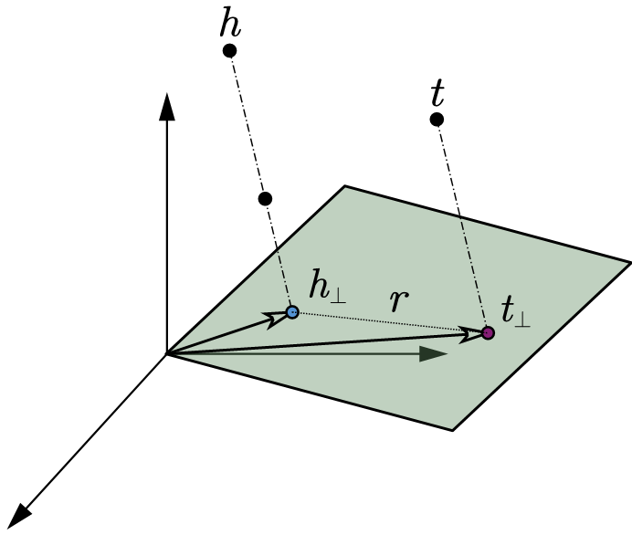
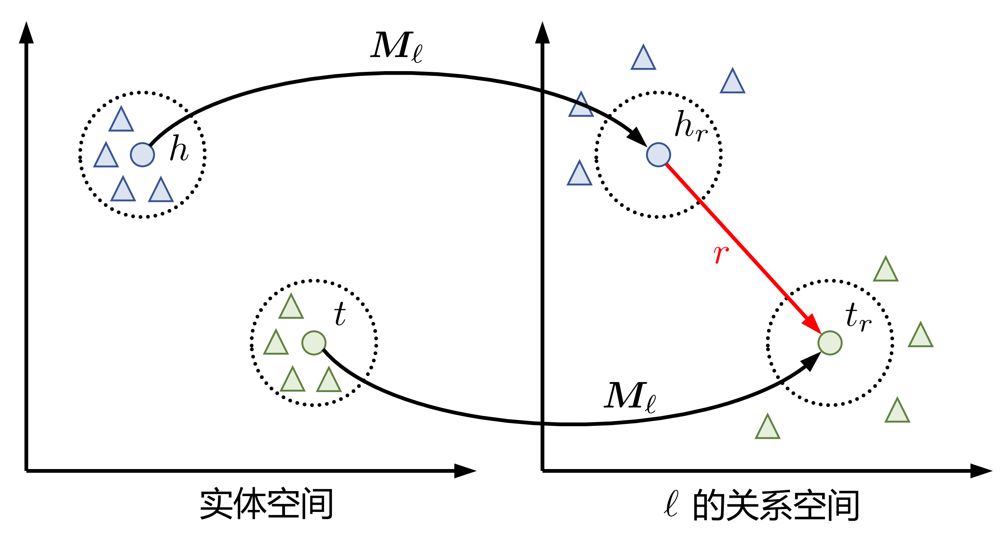

# 知识推理

在已经经过建模和知识表示的知识库的基础上，可以通过已有的推理规则对知识库进行推理得到新的知识。

## 逻辑推理（Logical Reasoning）

逻辑推理可以分为演绎推理（Deductive Reasoning，用于推导结论）归纳推理（Inductive Reasoning，用于学习规则）溯因推理（Abductive Reasoning，用于寻找前提）。

其中演绎推理可以通过前向推理（Forward Reasoning）和后向推理（Backward Reasoning）来实现：

- **前向推理**：从已有数据推导新的隐藏的公理（Classification）和断言（Materialization）直到达到目标。

<center>

</center>
<br/>
<center>

</center>

- **后向推理**：使用已有规则对查询进行重写（如果原有查询可以映射到查询结果则需要保留）。

<center>

</center>

<br/>

逻辑推理使用的一种数据存储语言是 Datalog，基本元素包括：

- 原子条目：$p(t_{1},\ t_{2},\ \cdots,\ t_{n})$，其中 $p$ 为谓词，$t_{i}$ 为变量或常量。
<br/>
- 规则：$H$`:-` $B_{1},\ B_{2},\ \cdots,\ B_{m}$，代表 $B_{1} \wedge B_{2} \wedge \cdots \wedge B_{m} \rightarrow H$，其中 $H$ 和 $B_{i}$ 均为原子条目。
<br/>
- 事实：$F(c_{1},\ c_{2},\ \cdots,\ c_{n})$`:-`，其中 $c_{i}$ 为常量。

```
PREFIX p: <http://www.example.org/kse/finance#>
PREFIX rdf: <http://www.w3.org/1999/02/22-rdf-syntax-ns#>
PREFIX rdfs: <http://www.w3.org/2000/01/rdf-schema#>

%% Facts
p:control(p:companyA,p:companyB) .
rdf:type(p:companyA,p:PublicCompany) .
rdf:type(p:companyB,p:Company) .
rdfs:subClassOf(p:PublicCompany,p:Company) .
rdfs:subClassOf(p:Company,p:Institution) .

%% Rules
p:hold_share(?X,?Y):- p:control(?X,?Y) .
p:conn_trans(?Y,?Z):- p:hold_share(?X,?Y), p:hold_share(?X,?Z) .
rdfs:subClassOf(?A,?C):- rdfs:subClassOf(?A,?B), rdfs:subClassOf(?B,?C) .
rdf:type(?A,?F):- rdf:type(?A,p:PublicCompany), rdfs:subClassOf(p:PublicCompany,?F) .
```
使用 Datalog 表示的交集关系：`Q:- R, S`；并集关系：`Q:- R. Q:- S`；差集关系：`Q:- R, NOT S`。

## 统计推理（Statistical Reasoning）

类似于 NLP 中的词嵌入，知识图谱中的知识同样可以通过统计方法嵌入到连续的向量空间。

<center>

</center>

<br/>

- **TransE（Translating Embeddings）模型**

理想的 TransE 模型将知识图谱建模为：$h + r = t$，其中 $h$、$r$ 和 $t$ 分别代表主语、谓语和宾语（非字面值）。

<table>
<tr>
    <td><center></center></td>
    <td><center></center></td>
</tr>
</table>

为了训练 RDF 三元组的嵌入向量，构造损失函数如下：
$$
\mathcal{L} = \sum_{(h,\ r,\ t) \in \mathcal{S}}\ \sum_{(h',\ r',\ t') \in \mathcal{S}'} \bigg[ \lambda + d(h + r,\ t) - d(h' + r',\ t') \bigg]
$$
其中正例三元组 $(h,\ r,\ t)$ 为原知识图谱中的三元组，负例三元组 $(h',\ r',\ t')$ 为随机生成的错误三元组。基于上述思想设计的 TransE 的学习过程的伪代码如下：

<center>

</center>

<br/>

对于 TransE 以及其他类似的 Knowledge Embedding 模型，可以使用预测的目标向量与所有实体向量之间的距离进行排序，得到正确实体的排序，基于上述排序值得到 Mean Rank（排序值的平均）以及 Hit@N（排序值在 N 以内的比例）指标来进行对模型效果进行评估。

理论上，TransE 可以很好地建模复合关系，例如：
```
（B，husband_of，A） <- （A，mother_of，C）（B，father_of，C）
```
但是 TransE 缺乏对对称关系的建模能力以及多元关系，例如：
```
（stu1，classmate，stu2）（stu2，classmate，stu1）
<!-- ------------------------- Symmetric Relation -------------------------- -->
（A，teacher_of，stu1）（A，teacher_of，stu2）（A，teacher_of，stu3）
<!-- --------------------------- N-ary Relation ---------------------------- -->
```

- **TransH（Translating on Hyperplanes）模型**

为了解决 TransE 无法建模多元关系的弊端，TransH 为每个关系 $r$ 额外增加了一个超平面用于投影。

<center>

</center>

<br/>

通过投影后的 $h_{\perp} = w_{r}^{\mathrm{T}} h w_{r}$ 和 $t_{\perp} = w_{r}^{\mathrm{T}} t w_{r}$ 建立关系：$h_{\perp} + r = t_{\perp}$，其中 $w_{r}$ 为关系 $r$ 对应的超平面法向量。

- **TransR 模型**

考虑到 TransE 和 TransH 模型的嵌入向量均在同一语义空间，TransR 为每个关系额外增加了一个语义空间。

<center>

</center>

<br/>

通过映射后的 $h_{r} = \mathbf{M}_{r} h$ 和 $t_{r} = \mathbf{M}_{r} t$ 建立关系：$h_{r} + r = t_{r}$，其中 $\mathbf{M}_{r}$ 为关系 $r$ 对应的语义空间映射矩阵。