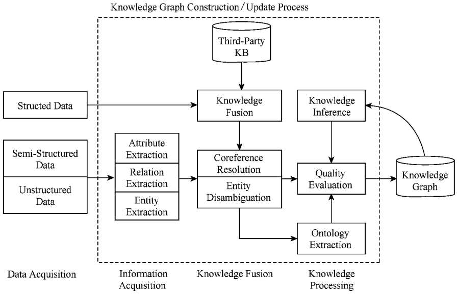
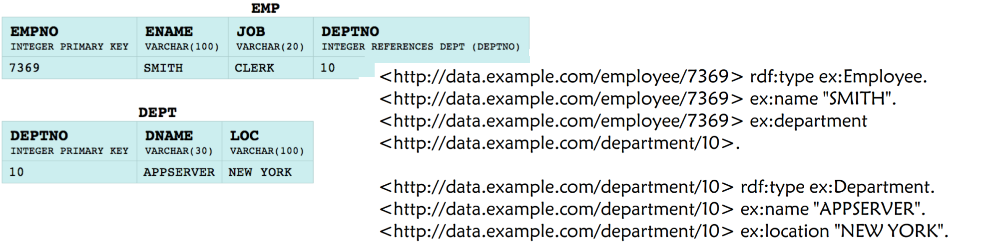
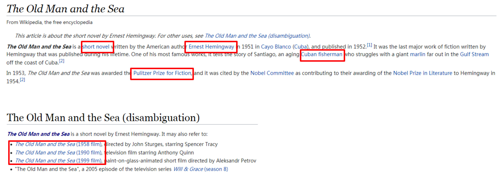
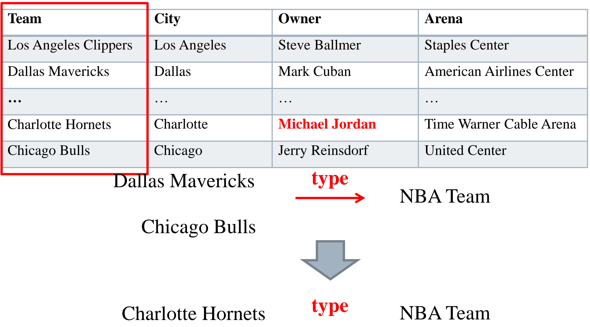
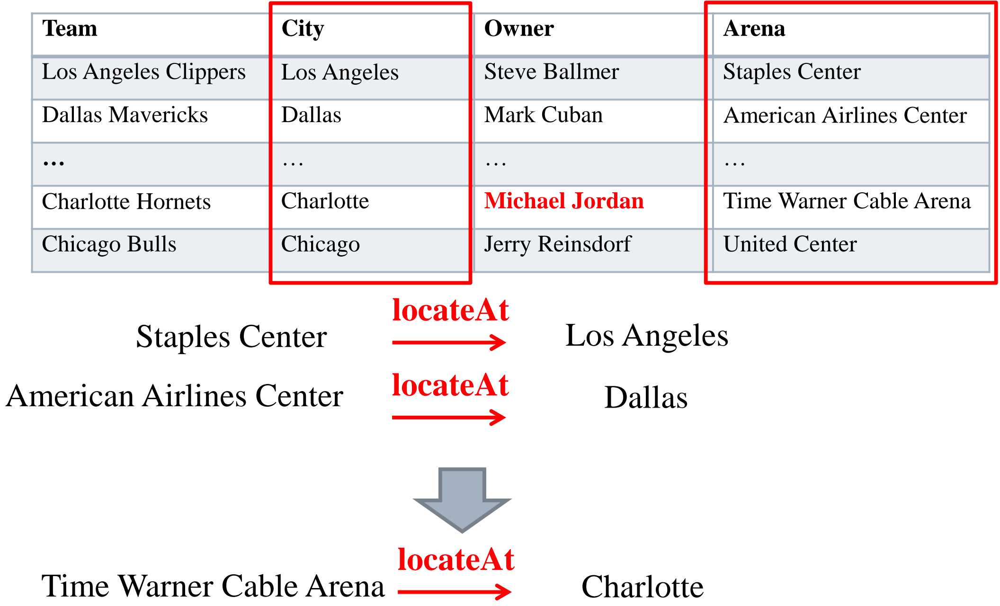
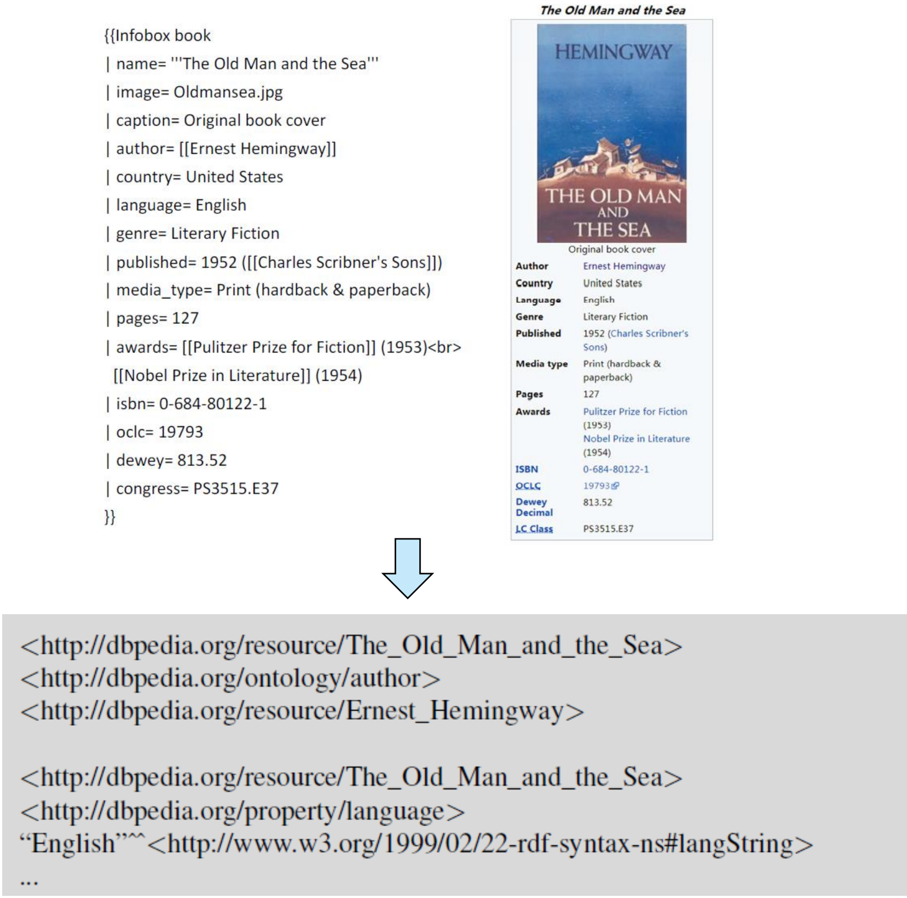
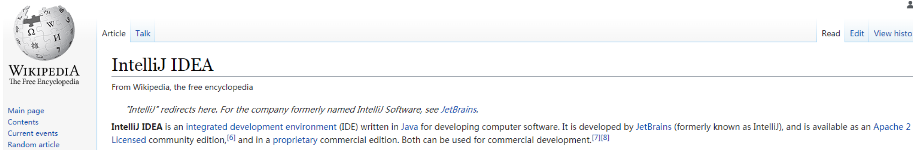
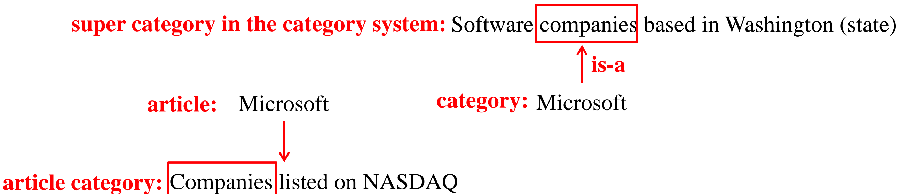
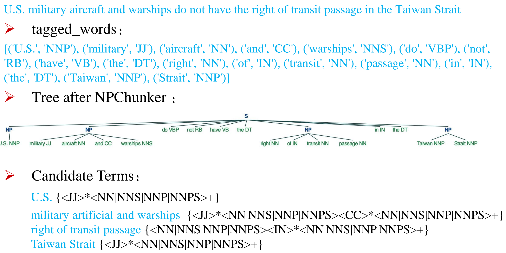

# 知识构建

知识图谱一般在异构的数据源进行大规模的自动化构建，分为结构化、半结构化以及非结构化数据构建。

<center>

</center>

## 结构化数据构建

结构化数据可以是关系型数据库（Relational Database）关系型表格（Relational Table），结合一定的映射标准或规则可以进行知识图谱大规模自动构建。

### 关系型数据库构建：RDB2RDF（Relational DataBase to RDF）

（1）直接映射（Direct Mapping）

<center>

</center>

<br/>

（2）R2RML（指定映射方式，可以自定义映射结果）

<center>

</center>

以上结果对应的 R2RML 映射规则如下：

```
@prefix rr: <http://www.w3.org/ns/r2rml#>.
@prefix ex: <http://example.com/ns#>.
<!-- ----------------------------------------------------------------------- -->
<#TriplesMap1>
    rr:logicalTable [rr:tableName "EMP"];           （指定数据库）
    rr:subjectMap [
        rr:template "http://data.example.com/employee/{EMPNO}";
        rr:class ex:Employee;                       （指定主语映射模板及其类别）
    ];
    rr:predicateObjectMap [
        rr:predicate ex:name;                       （指定某一列映射的谓语）
        rr:objectMap [rr:column "ENAME];            （该谓语对应的字面值宾语的列名）
    ];
    rr:predicateObjectMap [
        rr:predicate ex:department;
        rr:objectMap [
            rr:parentTriplesMap <#TriplesMap2>;     （指定资源宾语的映射规则）
            rr:joinCondition [
                rr:child "DEPTNO";                  （指定对应外键的列名）
                rr:parent "DEPTNO";                 （指定映射主键的列名）
            ];
        ];
    ];
<!-- ----------------------------------------------------------------------- -->
<#TriplesMap2>
    rr:logicalTable [rr:tableName "DEPT"];
    rr:subjectMap [
        rr:template "http://data.example.com/department/{DEPTNO}";
        rr:class ex:Department;
    ];
    rr:predicateObjectMap [
        rr:predicate ex:name;
        rr:objectMap [rr:column "DNAME"];
    ];
    rr:predicateObjectMap [
        rr:predicate ex:location;
        rr:objectMap [rr:column "LOC"];
    ];
```

### 关系型表格构建：Triple Extraction

基本步骤：实体链接（Entity Linking）&rarr; 类别抽取（Column Typing）&rarr; 关系抽取（Relation Extraction）。

<center>

</center>

<br/>

在实体链接时，首先需要使用较为简单的算法为每个词条生成候选实体集合（Candidate Generation），可以利用维基百科页面中实体和特殊字符串的配对频率来筛选候选实体，例如：

<center>

</center>

<br/>

也可以利用实体名称和条目之间的字符串相似度来筛选候选实体，例如：

**莱文斯坦距离（Levenshtein Distance）**：将字符串 A 变成 B 需要的最小步数（增加，删除和改变）

```
Saturday -1-(删除 a)-> Sturday -2-(删除 t)-> Surday -3-(r 改为 n)-> Sunday ==> 距离为 3
```

**杰卡德距离（Jaccard Distance）**：集合的交集大小除以集合的并集大小 $J(A,\ B) = \dfrac{|A \cap B|}{|A \cup B|}$

```
Michael Jeffrey Jordan --> {Michael，Jeffrey，Jordan}
Michael Irwin Jordan   --> {Michael，Irwin，  Jordan}
J = |{Michael, Jordan}| / |{Michael，Jeffrey，Irwin，Jordan}| = 0.5
<!-- ----------------------------- word level ------------------------------ -->
Chinese  --> {Chi，hin，ine，nes，ese}
Japanese --> {Jap，apa，pan，ane，nes，ese}
J = |{nes，ese}| / |{Chi，hin，ine，Jap，apa，pan，ane，nes，ese}| = 0.22
<!-- ---------------------- character-level trigrams ----------------------- -->
```

在以上两种方法外，还可以采用近义词得到更多候选实体，筛选结果的前 K 个即为候选实体集合。在生成的候选实体的基础上进行实体消歧（Entity Disambiguation），选出置信度最大的实体，完成实体链接。

实体消歧又可以分为局部消歧（不考虑表中其他实体，Local Disambiguation）和全局消歧（利用表中实体间的语义关联进行联合消歧，Global  Disambiguation）

- 局部消歧的生成式模型（Generative Model）

给定条目名字 $s$ 以及条目上下文 $c$（在关系型数据表中为对应行和列）的情况下，筛选出概率最大的实体 $e$：
$$
e = \argmax_{e} p(s,\ c,\ e) =\argmax_{e} p(e) p(s \mid e) p(c \mid e)
$$

<center>

</center>

<br/>

其中 $p(e)$ 通过标注后的大型语料库进行统计，结合拉普拉斯平滑（加一平滑）后的估计结果为
$$
\hat{p}(e) = \mathrm{count}(e) + 1 \bigg/ |\mathrm{M}| + \mathrm{N}
$$

基于语料库的标注信息，还可以统计元组 $(s,\ e)$ 的频率，进而用于 $p(s \mid e)$ 的估计
$$
\hat{p}(s \mid e) = \mathrm{count}(s,\ e) \bigg/ \sum_{s} \mathrm{count}(s,\ e)
$$

考虑到上下文 $c$ 作为整体进行统计时存在稀疏性，通常将 $c$ 分解为组成单元 $(t_{1},\ t_{2},\ \cdots,\ t_{n})$，并假设：
$$
p(c \mid e) = p(t_{1},\ t_{2},\ \cdots,\ t_{n} \mid e) = \prod_{i = 1}^{n} p(t_{i} \mid e)
$$

在此基础上，采用相同的方法对元组 $(t_{i},\ e)$ 的频率进行统计，得到 $p(t_{i} \mid e)$ 的估计：
$$
\hat{p}(t_{i} \mid e) = \mathrm{count}(t_{i},\ e) \bigg/ \sum_{t} \mathrm{count}(t,\ e)
$$

又考虑到基本组成单元 $t$ 也会存在稀疏性问题，可以通过更加大型的语料（例如维基百科）对其进行平滑
$$
\hat{p}(t \mid e) \leftarrow \lambda \hat{p}(t \mid e) + (1 - \lambda) p_{g}(t)
$$

- 全局消歧的图模型（Graph Model）

<center>

</center>

<br/>

条目 $s$ 和实体 $e$ 的语义关联度由字符串相似度 $strSim$（例如 Levenshtein 距离）和上下文相似度 $contSim_{se}$ 组成，其中上下文相似度是 $s$ 和 $e$ 上下文集合的 Jaccard 距离（$s$ 的上下文集合 $\mathrm{context}(s)$ 是同行同列的条目打散的单词组成的集合，$e$ 的上下文集合 $\mathrm{context}(e)$ 是图谱中相邻节点的 label 打散的单词组成的集合），而关联度则是以上两个相似度线性组合：
$$
SR_{se}(s,\ e) = \lambda(\alpha \cdot strSim(s,\ e) + \beta \cdot contSim_{se}(s,\ e)) + (1 - \lambda)
$$
实体 $e_{1}$ 和实体 $e_{2}$ 的语义关联度同样由两部分组成，即三元组关联特征 $IsRDF$（$e_{1}$，$e_{2}$ 是否在同一三元组中的指示函数）以及上下文相似度 $contSim_{ee}$（二者上下文集合 $\mathrm{context}(e)$ 的 Jaccard 距离），类似地，关联度仍然定义为两个相似度的线性组合：
$$
SR_{ee}(e_{1},\ e_{2}) = \lambda(\alpha \cdot IsRDF(e_{1},\ e_{2}) + \beta \cdot contSim_{ee}(e_{1},\ e_{2})) + (1 - \lambda)
$$
通过以上两个关联度可以为图中的每条边赋予关联度，进行归一化后得到对称邻接矩阵 $\mathbf{A}$，对每个节点赋予概率，组成一个 $n$ 维的向量 $r$，利用关联度矩阵 $\mathbf{A}$ 进行迭代更新直到收敛：
$$
r^{(t + 1)} = \bigg[ (1 - d) \frac{ \{1\}_{n \times n} }{n} + d\mathbf{A} \bigg] r^{(t)}
$$
在进行跨知识库联合消歧时，可以利用知识库间的 `sameAs` 得到一系列不同知识库的相同候选实体集合。

<center>

</center>

<br/>

任选一个（1）平均排名和最高排名在这一系列集合中排名最高（2）实体数量不小于知识库数量的半数的集合作为最终链接到的实体，如果所有的集合数量均小于知识库数量的半数，则保留该条目的原始链接。

对于剩下的两步：类别抽取以及关系抽取，可以使用实体链接的结果得到的类别和关系进行迁移，例如：

<center>

</center>

<center>

</center>

## 半结构化数据构建

常见的用于构建知识图谱的半结构化数据有维基百科的 Infobox 和 Categories。

### 事实抽取（Fact Extraction）

事实抽取用于提取一系列代表实体属性和实体间关系的三元组，对于具有一定结构的 Infobox 可以直接将其映射为三元组（同义的谓词表达也可以映射为相同的谓词，例如将 birthdate 和 dateOfBirth）。

<center>

</center>

对于结构性较差的 Categories，YAGO 提出了用于将 Categories 中文本映射为事实的正则表达式组，例如：

|匹配规则序号|正则表达式|目标关系的谓语|
|:-:|:-:|:-:|
|1|`([0-9]{3,4}) births`|`bornOnDate`|
|2|`([0-9]{3,4}) deaths`|`diedOnDate`|
|3|`([0-9]{3,4}) establishments`|`establishedOnDate`|
|4|`.* established in ([0-9]{3,4})`|`establishedOnDate`|
|5|`([0-9]{3,4}) books\|novels`|`writtenOnDate`|
|6|`Mountains\|Rivers\|etc. in (.*)`|`locatedin`|
|7|`Presidents\|Governors of (.*)`|`politicianOf`|
|8|`(.*) winners\|laureates`|`hasWonPrize`|
|9|`[A-Za-z]+ (.*) winners`|`hasWonPrize`|

被以上正则表达式命中的结果作为宾语，对应的目标关系作为谓语，并使用页面标题作为主语形成三元组。

<center>

</center>

<br/>

在得到三元组后还需要进行定义域和值域的检查，排除错误三元组。

### 类别推断（Type Inference）

Infobox 的头部本身可以看做着当前页面对应的实体的类别。维基百科组织的类别层次结构（Category）可以结合 Infobox 的属性对属性值实体进行类别推断，具体推断规则如下：

<center>

</center>

<br/>

YAGO 也使用启发式方法对页面中的 Categories 包含的类别信息进行抽取，通过句法分析得到 Categories 中每一项的被修饰词，如果被修饰词不是缩略语则保留为候选的概念项，遍历这些候选项时检查是否存在非概念性词（由 YAGO 进行总结），如果存在则进行滤除。

<center>

</center>

而这种方法的缺点则是无法跨语种使用，并且没有考虑实体和类别的语义关联，可能会导致错误的结果。

<center>

</center>

除了 Infobox 以及 Categories，每篇百科文章的第一个句子一般用于为该实体下定义，即包含类型信息。提取的过程一般是首先使用语法模式匹配得到可能得类型表述，再通过类型消歧链接到正确的百科实体上。

### 类别层次归纳（Taxonomy Induction）

类别层次归纳是为了识别实体之间的上下位关系（is-a relation，例如 `rdf:type` 或 `rdfs:subClassOf`）。维基百科本身的类别系统并不完善，只是一个按主题组织的词库。

<center>

</center>

为了对维基百科的类别系统进行处理和微调，可以采用以下几种方法：

（1）移除维基百科所管理的类别（如 categories、pages），并且使用模式 `Y X`、`X by Z` 等筛选出多余修饰的类别（如 Miles Davis **Albums**，**Albums** by artist）。

（2）如果两个类别共享相同的中心词（如 British Computer **Scientists**，Computer **Scientist**），那么这两个类别之间存在 is-a 关系；如果其中一个类别的中心词出现在另一个类别中的非中心词位置（如 **Crime** comics，**Crime**），则这两个类别被标记为 not-is-a 关系。

（3）提取某一个类别对应的文章中的 Categories 中条目的中心词，如果和类别系统里的上位类别的中心词相同，则认为该类别的父类是上述相同的中心词。

<center>

</center>

<br/>

（4）使用句法结构以及正则匹配

|is-a 关系的模式|例子|
|:-:|:-:|
|`NP2,? (such as\|like\|, especially) NP* NP1`|a **stimulant** such as **caffeine**|
|`such NP2 as NP* NP1`|such **stimulants** as **caffeine**|
|`NP1 NP* (and\|or), like) other NP2`|**caffeine** and other **stimulants**|
|`NP1, one of det_pl NP2`|**caffeine**, one of the **stimulants**|
|`NP1, det_sg NP2 rel_pron`|**caffeine**, a **stimulant** which|
|`NP2 like NP* NP1`|**stimulants** like **caffeine**|

|not-is-a 关系的模式|例子|
|:-:|:-:|
|`NP2's NP1`|**car**'s **engine**|
|`NP1 in NP2`|**engine** in **car**|
|`NP2 with NP1`|a **car** with an **engine**|
|`NP2 contain(s\|ed\|ing) NP1`|a **car** containing an **engine**|
|`NP1 of NP2`|the **engine** of the **car**|
|`NP1 are? used in NP2`|**engines** used in **cars**|
|`NP2 ha(s\|ve\|d) NP1`|a **car** has an **engine**|

（5）利用传递性提取剩余的上下位关系

## 非结构化数据构建

非结构化数据多指自由形式的文本，除了 NLP 中重点研究的任务，以下是两个知识工程中较为特别的任务：

### 类别层次归纳（General is-a Relation Extraction）

- 基于正则表达式的方法（**Hearst Patterns**）

|正则表达式|例子|
|:-:|:-:|
|`NP such as {NP,}*{(or\|and)} NP`|The bow lute **such as** the Bambara ndang|
|`such NP as {NP,}*{(or\|and)) NP`|**such** authors **as** Herrick, Goldsmith, and Shakespeare|
|`NP{,} including {NP,}*{(or\|and)) NP`|common-law countries, **including** Canada and England|
|`NP{,NP}*{,} and other NP`|temples, treasuries, **and other** important civic buildings.|
|`NP{,NP}*{,} or other NP`|Bruises, wounds, broken bones **or other** injuries|
|`NP{,} especially {NP,}*{(or\|and)} NP`|European countries, **especially** France, England, and Spain|

- 基于词嵌入向量的监督、无监督方法

由于正则表达式的模式匹配没有考虑语义关联，可以使用词嵌入模型（BERT、Word2Vec 等）进行编码。

**WeedsPrec** 基于分布包含假设，即下位词只出现在上位词的一些上下文中，但上位词出现在下位词的所有上下文中，并给出了一个非对称的上下位相似度度量方法：
$$
\mathrm{WeedsPrec}(u \rightarrow v) = \sum_{f \in F_{u} \cap F_{v}} W_{u}(f) \bigg/ \sum_{f \in F_{u}} W_{u}(f)
$$
其中 $F_{u}$ 是 $u$ 的上下文词汇集合，而 $W_{u}(f)$ 代表 $f$ 和 $u$ 之间的统计关联度，例如 PMI 相似度
$$
\mathrm{PMI}(u,\ v) = \log \frac{p(u,\ v)}{p(u)p(v)} = \log \frac{p(u \mid v)}{p(u)} = \log \frac{p(v \mid u)}{p(v)}
$$
除了 WeedsPrec 这种无监督方法，也可以借助标签信息对某个判别模型 $f(u,\ v) \in [0,\ 1]$ 进行有监督训练。

### 术语抽取（Terminology Extraction）

- 预处理（Preprocessing）

分词（Tokenization）&rarr; 去停用词（Stopwords）&rarr; 词性标注（POS tagging）&rarr; 词形还原（Lemmazation）...

- 候选术语抽取（Candidate Terminology Extraction）

（1）基于语法结构进行抽取：统计表明绝大多数术语为名词短语（NP），为了识别这些名词短语，可以在词性标注的基础上设定词性正则匹配模板（Chunker），匹配得到候选术语

<center>

</center>

<br/>

（2）基于统计的方式进行抽取：常用的统计标准有 TF-IDF 以及 PMI，TF-IDF 的表达如下：
$$
\mathrm{TF \cdot IDF}(t,\ doc \mid corpu) = \mathrm{TF} \times \mathrm{IDF} = \frac{\mathrm{count}(t \mid doc)}{|doc|} \times \log \left( \frac{|corpu|}{\mathrm{count}(t \mid corpu) + 1} \right)
$$

其中 $\mathrm{count}(t \mid doc)$ 代表文档 $doc$ 中 $t$ 出现的次数，$\mathrm{count}(t \mid corpu)$ 代表语料库 $corpu$ 中包含 $t$ 的文档个数。

（3）基于图的方式进行抽取：类比于互联网中的 PageRank 概念，使用 TextRank 来提取候选实体：
$$
\mathrm{PR}(i) \leftarrow (1 - d) + d \times \sum_{j \in In(i)} \frac{\mathrm{PR}(j)}{|\mathrm{Out}(j)|}
$$

其中，$In(i)$ 是链接到网页 $i$ 的网页集合，$\mathrm{Out}(j)$ 是网页 $j$ 的外链网页集合，$d$ 是用户点开网页中链接的概率。通过上式进行反复迭代，最终每个网页的 PageRank 都会收敛到一个稳定值。类似地，在通过局部滑窗得到 co-occur 关系（带有统计信息 $w_{ij}$）形成的图的基础上，计算 TextRank：
$$
\mathrm{TR}(i) \leftarrow (1 - d) + d \times \sum_{j \in In(i)} \frac{w_{ji}}{\sum_{k \in Out(j)} w_{jk}} \mathrm{TR}(j)
$$

- 过滤（Filtering）

在抽取的候选术语的基础上需要对结果进行过滤操作，只保留高置信度的术语。可以使用常用词词典来过滤掉一部分常见词汇或短语（Common Dictionary Filtering），对于可能存在的不正常的表述但被识别为了术语，可以利用一下评估分数来进行过滤（Irregular Filtering）：
$$
\mathrm{score}(a) \leftarrow \frac{\mathrm{count}(a)}{\mathrm{count(b)} + \mathrm{count}(c) - \mathrm{count}(a)}
$$

其中 $a$ 为候选术语短语，$b$ 是 $a$ 去掉第一个单词的短语，$c$ 是 $a$ 去掉最后一个单词的短语，如果 $a$ 是术语，那么 $a$ 在当前语料库中更可能是一种固定用法，即 $b$ 和 $c$ 的出现一定伴随着 $a$ 的出现，分数 score 倾向于更高。