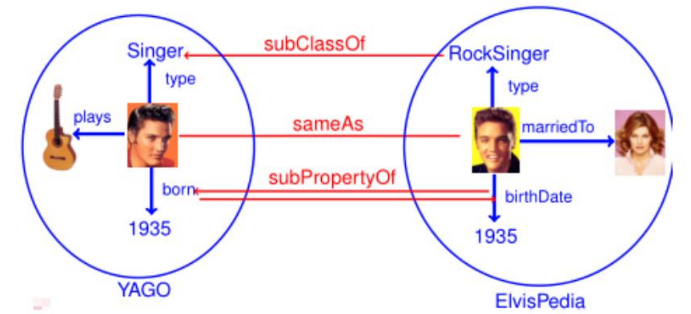
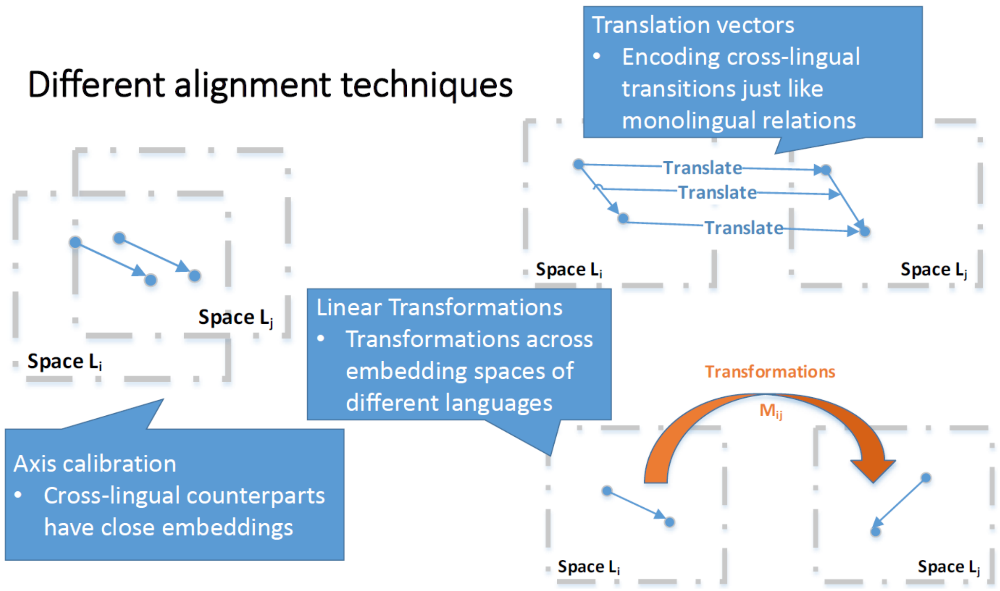

# 知识对齐

在存在多个知识图谱的情况下，去匹配跨图谱的实体对齐关系（instance &rarr; `sameAs` class &rarr; `subClassOf` property &rarr; `subPropertyOf`）。

## 元素级匹配（Element-Level Matching）

只利用资源的标签名称而不考虑其他资源，可以采取以下几种方法：

- 基于前缀（Prefix）后缀（Suffix）的方法

通过前后缀进行对齐，例如 net & network，ID & PID，但容易产生错误，例如 hot & hotel，word & sword。

- 基于字符串相似度的方法

除了之前介绍过的 Levenshtein 距离（对称度量）Jaccard 距离（对称度量）外，还有以下相似度可供选择：

（1）N-gram 距离（对称度量）
$$
\mathrm{N\_gram} = \frac{|A \cap B|}{\max(|A|,\ |B|)}
$$

（2）最大共同子串 LCS 相似度（非对称度量）
$$
\mathrm{CLsim}(a,\ b) = \frac{\mathrm{LCS}(a,\ b)}{|a|}
$$

- 基于语言处理的方法

通过 Tokenlization、Lemmatization 等方式对资源名称进行处理，从而识别对齐关系。

- 基于资源的方法

提前准备大量上下位关系以及同义词关系的数据，例如使用 WordNet。

## 结构级匹配（Structure-Level Matching）

考虑图谱本身的图结构（即资源之间的关系），例如通过一阶邻居集合的 Jaccard 距离作为度量

 

$$
\mathrm{sim}(\mathrm{Car},\ \mathrm{Automobile}) = \frac{|\mathrm{neighbour(Car)} \cap \mathrm{neighbour(Automobile)}|}{|\mathrm{neighbour(Car)} \cup \mathrm{neighbour(Automobile)}|} = 0.5
$$

## 对齐知识嵌入（MTransE）

MTransE 的三种形式（1）嵌入到相同空间以对齐（2）空间之间需要平移（3）空间之间需要线性变换

|形式|考虑关系 $r$ 的表达|不考虑关系 $r$ 的表达|
|:-:|:-:|:-:|
|（1）|$\mathcal{L} = \|\| h - h' \|\| + \|\| r - r' \|\| + \|\| t - t' \|\|$|$\mathcal{L} = \|\| h - h' \|\| + \|\| t - t' \|\|$|
|（2）|$\mathcal{L} = \|\| h + v_{ij}^{(e)} - h' \|\| + \|\| r + v_{ij}^{(r)} - r' \|\| + \|\| t + v_{ij}^{(e)} - t' \|\|$|$\mathcal{L} = \|\| h + v_{ij}^{(e)} - h' \|\| + \|\| t + v_{ij}^{(e)} - t' \|\|$|
|（3）|$\mathcal{L} = \|\| \mathbf{M}_{ij}^{(e)} h - h' \|\| + \|\| \mathbf{M}_{ij}^{(r)} r - r' \|\| + \|\| \mathbf{M}_{ij}^{(e)} t - t' \|\|$|$\mathcal{L} = \|\| \mathbf{M}_{ij}^{(e)} h - h' \|\| + \|\| \mathbf{M}_{ij}^{(e)} t - t' \|\|$|

