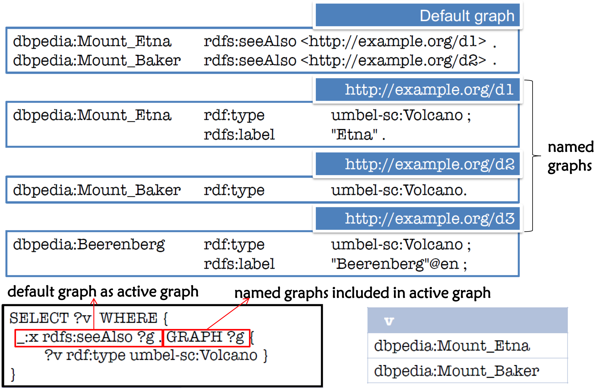
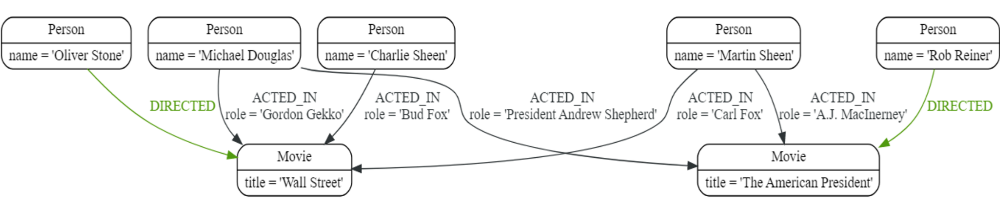

# 知识查询

在已有知识库的基础上可以使用形式化查询语言对知识进行查询，可以用于知识图谱的查询语言包括 SPARQL（RDF 三元组数据库，例如 RDF4j）以及 Cypher（图数据库，例如 Neo4j）。

<center>

</center>

## SPARQL（SPARQL Protocol and RDF Query Language）

SPARQL 使用 RDF 三元组模式对 RDF 数据库进行图匹配，基本的查询语句形式和组成如下所示：
```
PREFIX rdf:<http://www.w3.org/1999/02/22-rdf-syntax-ns#>
PREFIX umbel-sc:<http://umbel.org/umbel/sc/>
<!-- ------------------------------ prologue ------------------------------- -->
SELECT ?v                               （查询形式以及查询变量声明）
FROM <http://example.org/myGeoData>     （数据集指定，缺省时为默认数据集）
WHERE {
    ?v rdf:type umbel-sc:Volcano .      （查询模式）
}
ORDER BY ?name                          （查询结果修饰）
```

声明默认前缀可以采用 `PREFIX :<IRI>` 或 `BASE <IRI>` 两种方式，查询模式中三元组以 Turtle 形式书写。

- 查询块中的一些特殊关键字：

（1）使用 `OPTIONAL` 关键字可以指定一条匹配规则为可选，例如：

```
@prefix foaf: <http://xmlns.com/foaf/0.1/> .
_:a foaf:name "Alice" . 
_:a foaf:homepage <http://work.example.org/alice/> . 
_:b foaf:name "Bob" . 
_:b foaf:mbox <mailto:bob@work.example> .
<!-- -------------------------------- data --------------------------------- -->
PREFIX foaf: <http://xmlns.com/foaf/0.1/> 
SELECT ?name ?mbox ?hpage
WHERE {
    ?x foaf:name ?name . 
    OPTIONAL { ?x foaf:mbox ?mbox . }
    OPTIONAL { ?x foaf:homepage ?hpage . }
}
<!-- -------------------------------- query -------------------------------- -->
name      mbox                          hpage
"Alice"                                 <http://work.example.org/alice/>
"Bob"     <mailto:bob@work.example>
<!-- ------------------------------- result -------------------------------- -->
```

（2）使用 `FILTER` 关键字可以对匹配模式施加限制，过滤查询结果，例如：

```
@prefix dc: <http://purl.org/dc/elements/1.1/> . 
@prefix : <http://example.org/book/> .
@prefix ns: <http://example.org/ns#> . 
:book1 dc:title "SPARQL Tutorial" . 
:book1 ns:price 42 . 
:book2 dc:title "The Semantic Web" . 
:book2 ns:price 23 .
<!-- -------------------------------- data --------------------------------- -->
PREFIX dc: <http://purl.org/dc/elements/1.1/> 
PREFIX ns: <http://example.org/ns#> 
SELECT ?title ?price 
WHERE {
    ?x dc:title ?title . 
    ?x ns:price ?price .
    FILTER (?price < 30)
}
<!-- -------------------------------- query -------------------------------- -->
title                   price
"The Semantic Web"      23
<!-- ------------------------------- result -------------------------------- -->
```

（3）使用 `UNION` 关键字可以设置替换模式，例如：

```
@prefix dc10: <http://purl.org/dc/elements/1.0/> . 
@prefix dc11: <http://purl.org/dc/elements/1.1/> . 
_:a dc10:title "SPARQL Query Language Tutorial" . 
_:a dc10:creator "Alice" . 
_:b dc11:title "SPARQL Protocol Tutorial" . 
_:b dc11:creator "Bob" . 
_:c dc10:title "SPARQL" . 
_:c dc11:title "SPARQL (updated)" .
<!-- -------------------------------- data --------------------------------- -->
PREFIX dc10: <http://purl.org/dc/elements/1.0/>
PREFIX dc11: <http://purl.org/dc/elements/1.1/> 
SELECT ?title 
WHERE {
    { ?book dc10:title ?title . } 
    UNION { ?book dc11:title ?title . }
}
<!-- -------------------------------- query -------------------------------- -->
title
"SPARQL Protocol Tutorial"
"SPARQL"
"SPARQL (updated)"
"SPARQL Query Language 
Tutorial"
<!-- ------------------------------- result -------------------------------- -->
```

（4）使用 `GRAPH` 关键字可以在查询块内指定一个命名数据集，例如：

<center>

</center>

<br/>

- 除了 `SELECT` 之外的其他查询形式

|查询形式|查询作用|查询形式|查询作用|
|:-:|:-:|:-:|:-:|
|`DESCRIBE`|返回包含某一资源的全部三元组 以及三元组中资源的全部三元组|`ASK`|检查查询结果是否存在|
|`CONSTRUCT`|依据模板构造一个新的三元组数据集|`UPDATE`|`DELETE` + `INSERT`|
|`MOVE`|将输入数据集的所有数据移动到目标数据集|`INSERT`|向数据集中插入新的三元组|
|`CLEAR`|清空给定数据集中所有的三元组|`DELETE`|从数据集中删除三元组|

```
CONSTRUCT {
    ?v rdfs:label ?name ;
       rdf:type myTypes:VolcanosOutsideTheUS .
}
WHERE {
    ?v rdf:type umbel-sc:Volcano ;
       rdfs:label ?name .
    OPTIONAL { ?v p:location ?l. FILTER (?l = dbpedia:United_States) }
    FILTER (!BOUND(?l))
}
<!-- ----------------------------------------------------------------------- -->
PREFIX foaf: <http://xmlns.com/foaf/0.1/>
WITH <http://example/addresses>
DELETE { ?person foaf:givenName 'Bill' . }
INSERT { ?person foaf:givenName 'William' . }
WHERE {
    ?person foaf:givenName 'Bill' .
}
```

- 查询结果修饰词：

|修饰词|修饰词作用|修饰词|修饰词作用|
|:-:|:-:|:-:|:-:|
|`DISTINCT`|去掉重复的查询结果|`LIMIT`|限制查询结果的数量|
|`ORDER BY`|按某个变量进行排序|`OFFSET`|从第 n 个结果开始返回|
|`BIND AS`|将表达式绑定到变量|`VALUES`|限制变量取值范围|

## Cypher

在 Neo4j 中，每个节点和边均有标签（类别）和属性值（字面值），并以有向图的形式存储，例如：

<center>

</center>

<br/>

使用 `CREATE` 操作可以创建单个节点或节点 + 关系

```
CREATE (node:Person {name:”Emil” from:”Sweden”})
<!-- ----------------------------- single node ----------------------------- -->
CREATE 
    (n1:Person {name:”Martin Sheen”})
    -[r:ACTED_IN {role:”President Andrew Shepherd”}]
    ->(n2:Movie {title:”Wall Street”})
<!-- ----------------------------- node & edge ----------------------------- -->
```

使用 `MATCH` 操作可以进行图匹配，匹配中声明的变量可以返回，或进一步用于创建、更新、删除等
```
MATCH (n)  # 匹配所有节点          MATCH (movie:Movie)  # 匹配所有标签为 Movie 的节点

MATCH (director {name: 'Oliver Stone'})-[r]-(movie)
# 方向不明的边匹配
MATCH (wallstreet:Movie {title: 'Wall Street'})<-[r:ACTED_IN]-(actor)
# 方向明确的边匹配
MATCH (wallstreet:Movie {title: 'Wall Street'})<-[:ACTED_IN|:DIRECTED]-(person:Person)
# 多种标签匹配
MATCH (:Person {name: 'Oliver Stone'})-[r]->(movie)  RETURN type(r)
# 匹配得到结果后返回
```
在匹配的节点的基础上可以单独创建一条边（区别于直接 `CREATE` 节点 + 边）
```
MATCH
    (charlie:Person {name: 'Charlie Sheen'}), 
    (rob:Person {name: 'Rob Reiner'})
CREATE
    (rob)-[:TYPE INCLUDING A SPACE]->(charlie)
```
通过匹配可以删除指定的节点或边
```
MATCH (n {name: 'Andy’}) DETACH DELETE n  # 删除节点以及相连的边

MATCH (n {name: 'Andy'})-[r:KNOWS]->() DELETE r
```
除了删除和创建操作外，还可以对图中信息进行更新
```
MATCH (n {name: 'Andy'})
SET n.position = 'Developer', n.surname = 'Taylor'
# 单独设置属性值
MATCH (p {name: 'Peter'})
SET p = {name: 'Peter Smith’, position: 'Entrepreneur'}
# 直接覆写整个节点
```